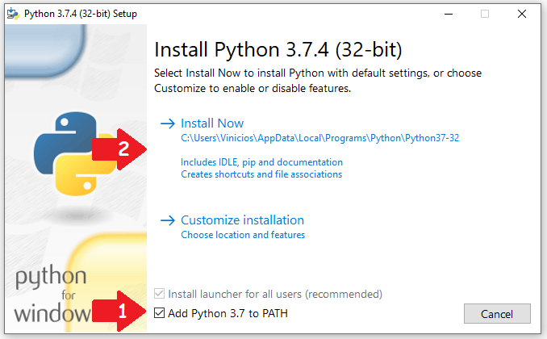
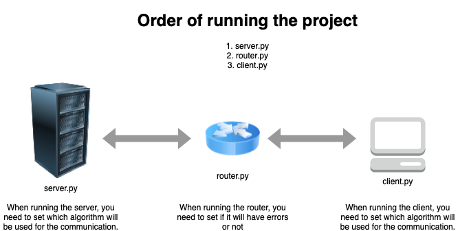

# Error Detection and Correction Algorithms in Python

In this repository, we have the implementation from scratch of some error detection and correction algorithms used in computer networks.

## Installation

If you don't have Python installed in your computer, follow the steps related to your operating system (OS).

### Ubuntu and MacOS

To install Python and Python's Virtual Environment on Ubuntu, run the following commands on terminal:
```bash
$ sudo apt-get update
$ sudo apt-get install python3 python3-venv
```

On the other hand, to install it on MacOS, run:
```bash
$ brew install python3
```

This implementation has no dependecies, but it is better if you create a virtual environment to execute it.

Create a virtual environment.
```bash
python3 -m venv venv --prompt="error-detection"
```

After that, we will have a venv folder in the directory. Activate the virtual environment.
```bash
source venv/bin/activate
```

Now you have the virtual environment activated.

### Windows
To install Pyton on Windows, you have to download the its installer. Go to the [Python's website](https://www.python.org/downloads/windows/) and choose the proper installer.

Run the installer, and REMEMBER TO SET THE ADD PYTHON TO PATH OPTION.



After the installation, open your CMD, enter in the project directory, and create a virtual environment to run this project.

To create a virtual environment, run this command on Windows CMD.
```cmd
python3 -m venv venv --prompt="error-detection"
```

After that, we will have a venv folder in the directory. Then, run:
```cmd
C:\Users\Guy\Download\error_detection> .\venv\Scripts\bin\activate.bat 
```

Now you have the virtual environment activated.

## Usage



Execute first the server, so the router and client will have who connect with. You need to have three terminal windows opened, and they need to have the virtual environment activated. Also, you have to pass the name of the algorithm as argument when running the server.py.
```bash
(error-detection) $ python server.py -a crc
```
or
```bash
(error-detection) $ python server.py --algorithm hamming
```

Then you run the router, setting if it will cause errors or not.
```bash
(error-detection) $ python router.py -e
```
or
```bash
(error-detection) $ python router.py --error
```

Now you can run the client, but in another terminal window. Remember you have to pass the same algorithm that you passed for the server.
```bash
(error-detection) $ python client.py -a crc
```
or
```bash
(error-detection) $ python client.py --algorithm hamming
```

The algorithm options are: parity, crc, hamming, reed-solomon. Suppose you want to run the Reed-Solomon algorithm, so you have to run the server, router and the client, respectively, as follows:

First terminal window
```bash
(error-detection) $ python server.py --algorithm parity
```

Second terminal window
```bash
(error-detection) $ python router.py -e
```

Third terminal window
```bash
(error-detection) $ python client.py --algorithm parity
```

## File Description

```bash
├── README.md # this file
├── img # folder that contains the image used in the README.md
└── error-detection # folder that contains all the code
    ├── algorithms # folder that contains the algorithm implementations
    │   ├── crc.py # Cyclic Redundancy Check implementation
    │   ├── hamming.py # Hamming Code implementation
    │   ├── parity.py # Odd Parity Error Detection implementation
    │   └── reed_solomon.py # Reed-Solomon Code implementation
    ├── client.py # Simulating the client side, where it sends a message to the server
    ├── router.py # Simulating a router, where errors can be added to the bit chain
    └── server.py # Simulating the server side, where the message is processed and it verifies if the message contains any error
```